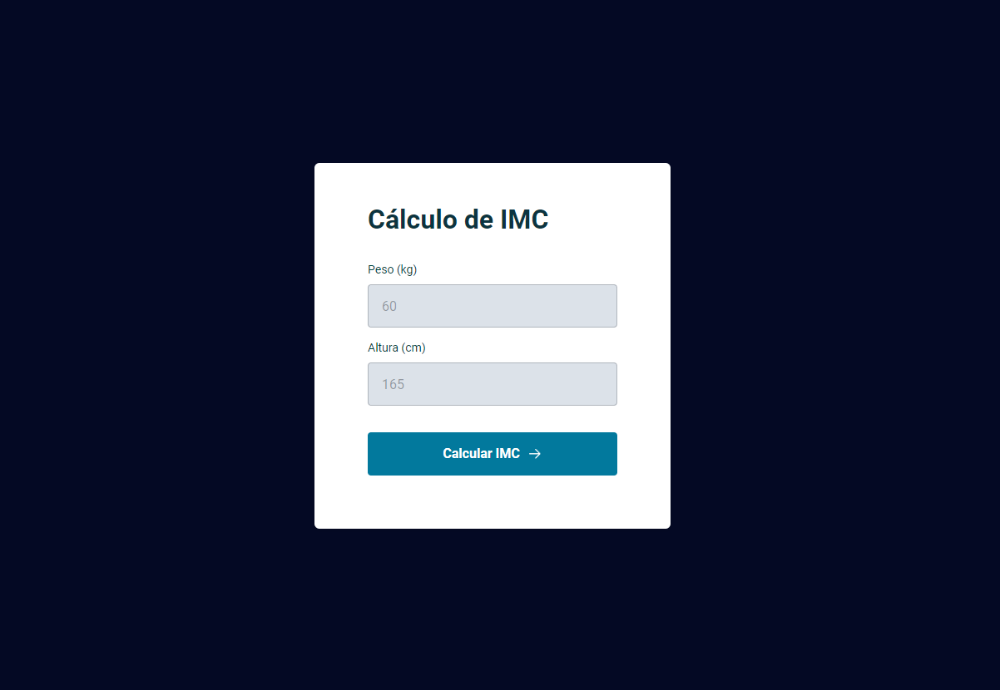

<h1 align="center"> IMC/BMI - Calculator </h1>

 Deploy Link - https://rafacelos.github.io/NLW-Cup-Card/

  Body mass index (BMI) calculator.

  <a href="#-technologies">Technologies</a>&nbsp;&nbsp;&nbsp;|&nbsp;&nbsp;&nbsp;
  <a href="#-project">Project</a>&nbsp;&nbsp;&nbsp;|&nbsp;&nbsp;&nbsp;
  <a href="#-layout">Layout</a>&nbsp;&nbsp;&nbsp;|&nbsp;&nbsp;&nbsp;
  <a href="#memo-license">License</a>

  

 

  

## 🚀 Technologies

This project was developed with the following technologies:

- HTML and CSS
- JavaScript
- Figma

## 💻 Project

 The project calculates the BMI based on the person's height and weight.

## :memo: License

This project is under the MIT license.

---

Created with ♥ by Rafacelos :wave: [Talk to me on linkedin!](https://www.linkedin.com/in/rafaeloliveiradev)
